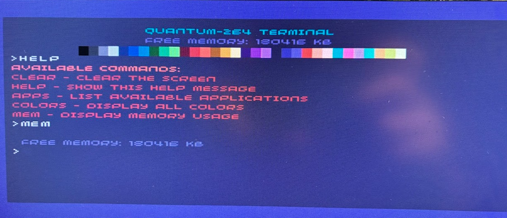

<BlogTitle />

### Moving towards a 32-Color Palette and Terminal
Over the last couple of days, I’ve been deep in the codebase, experimenting with various commands and encountering all sorts of issues along the way. The biggest challenge so far? The screen keeps flashing unexpectedly or rendering text in strange ways. This is likely due to the dual buffer requiring a double render—something I clearly haven’t handled correctly yet. But despite these hurdles, the most important thing is that I’m having fun coding and getting something onto the screen.

### Introducing Quantum-264

I’ve decided on a name: Quantum-264. This name is a nod to several things. “Quantum” carries that somewhat misplaced sense of “techy futurism” that was so prevalent in 80s technology branding. The “264” is a reference to the memory capacity of the PicoVision, much like how the Commodore 64 was named for its 64KB of RAM. It just felt fitting.

### Creating a 32-Color Palette and Terminal

One of the first tangible steps was designing a 32-color palette—something broad enough to provide variety yet limited enough to create a distinct visual style. It spans the spectrum, offering enough contrast to be useful while keeping things simple and aesthetically cohesive.

Another milestone was getting a ‘terminal’ on the screen. Now, when I type a help command, it actually prints out some responses. It’s rudimentary, but it’s progress, and seeing something interactive on-screen is always a rewarding moment.

### Hitting Frustration Points

Progress, however, hasn’t been without its frustrations. The USB Host code hasn’t been working quite as I’d like—it’s basically just an FTDI, which isn’t ideal for my needs. On top of that, the terminal code is becoming an unmanageable spaghetti mess, making future improvements harder.

Despite the chaos, I committed my changes and moved on. Some days in coding are smooth, and others feel like you’re just wrestling with problems that seem to multiply. But at the end of the day, progress is progress. On to another day of debugging and refining!