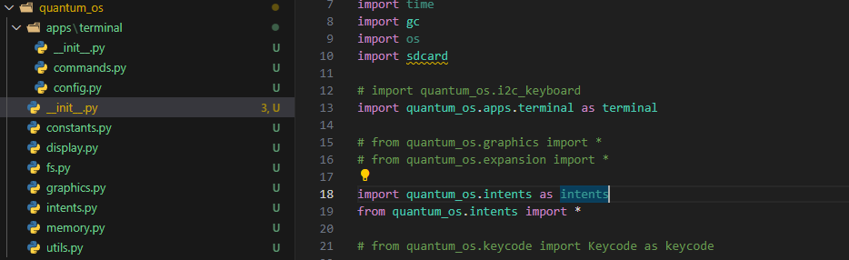

<BlogTitle />

As I continued digging into Abe's codebase, I was eager to find clues about the issue I had been facing. Along the way, I uncovered some fascinating aspects of their architecture—particularly their use of intents and the way applications were loaded. It was clear that there was a level of depth and structure in Abe’s code that my own scrappy implementation lacked. What I had built so far wasn't really an operating system; it was more akin to a single application with a terminal-style interface. While I appreciated the elegance of Abe's approach, I knew I didn’t want to create a GUI with icons and menu bars. My goal was something leaner and more streamlined.

# Reaching Out for Clarity

One thing that immediately caught my attention was the absence of a LICENSE file in Abe’s code repository. Unsure of the legal standing of using their work, I decided to send an email. To my surprise, I received a response within just a few hours. Abe confirmed that the code was licensed under MIT, meaning I was free to use, modify, and distribute it as I saw fit. Encouraged by this, we exchanged a few emails, and I even shared some of what I had been working on.

# The Snowball Effect

This is where things started to spiral. The more I explored Abe’s code, the more I wanted to integrate elements of it into my own project. I began pulling in components I liked from SlimeOS, though I was mindful of not blindly incorporating everything. However, as I was still relatively new to their codebase, I struggled to discern which parts were essential and where they belonged. My goal was to boot directly into their I2C scanner app from my terminal interface, but this endeavor quickly led me down a rabbit hole of unforeseen complications.

I soon realised that what I had created wasn’t a true OS—at least, not in the conventional sense. By trying to integrate elements of Abe’s system, I had effectively opened Pandora’s box. Errors and issues cropped up that I didn’t fully understand, sending me on an endless loop of Googling, consulting GPT, and poring over documentation. The process was frustrating but also incredibly educational. Trial and error became my new normal.

# Making Progress (Sort Of)

After much wrestling with the code, I managed to get most of the intents in place—though more through sheer emulation than a true understanding of the underlying mechanics. I copied relevant pieces of code into their respective locations, and slowly but surely, the system began to take shape. It wasn’t pretty, but it was progress.

At this point, I decided to simplify things. Instead of attempting a full integration, I focused on extracting only the core components of the I2C scanner app. My new plan was to create a simple “Hello, World” application that would auto-boot. It seemed like a manageable step forward.

That’s when I encountered my next unexpected challenge. Instead of displaying a simple message, my test app began rapidly flashing on the screen—so much so that I ended up adding an epilepsy warning to my README file before calling it a day.
