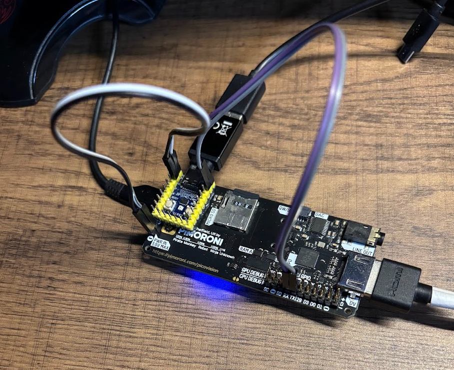

<BlogTitle />

# Housekeeping and Hardware Upgrades

Today was a day for housekeeping, tackling some of the lingering technical debt that had been accumulating in my project. The biggest issue was the mess of unsoldered cables I had left unresolved, mainly because I hadn’t fully committed to the final wiring setup. The uncertainty over the type of PCB it would mount to and other downstream decisions had kept me in a limbo of half-done electrical connections. This meant that debugging was often split between actual code issues and the instability of my temporary wiring.

# Bringing Order to the Chaos

To bring some order to the chaos, I focused on two key changes:

1. **Soldering header pins** – This allowed me to establish solid electrical connections, eliminating the debugging frustration caused by unreliable contact points.
2. **Swapping the keyboard Pico for a Waveshare RP2040** – This change enabled me to plug the keyboard in directly via USB-C. Additionally, the RP2040’s small form factor allowed me to easily secure it to the Picovision using some good old gorilla tape, making the entire setup far more manageable.

# Organising the Color Palette

In parallel, I also worked on organising my color palette within Aseprite. By indexing and reordering it based on hue, I made sure it would be more structured and intuitive moving forward, preventing unnecessary references across the codebase. A small change, but one that would make life easier in the long run.

# Debugging Abe’s Code

Another significant step today was diving into Abe’s code, particularly making sense of the i2c app rendering to the screen. I made some progress, but there was a peculiar issue: the display was upside down, back to front, and squished into the top left corner.

My initial assumption was that I had made a mistake somewhere in my display code, given that I was new to the PicoGraphics framework. However, after some deeper investigation, I had a realisation: Abe’s SlimeDeck used a custom display, and given the physical constraints, it was likely installed rotated by 180 degrees. I reached out to confirm, and sure enough, that was the case!

Not only had Abe built a well-structured, multitasking-capable OS, but he had also done so with the display logic inverted—loops counting down, offsets subtracted, and the drawing process beginning in the bottom-right corner. Absolute madness! But I wasn’t going to let that stop me.

# Implementing HID-over-UART

The next roadblock was my ASCII over UART implementation, which, unsurprisingly, wasn’t sending arrow keys correctly. This led to the decision to implement HID-over-UART instead. Changing Adrian’s USB Host code was relatively straightforward, as they had already stripped most of the noise from the TinyUSB host examples. Their code converted HID reports to ASCII, so in theory, I just needed to send the report. But of course, it wasn’t that easy.

HID operates at a high bandwidth, and even at 115200 baud, I was encountering substantial noise and errors. While the principle was working—I could get HID data over the wire—it wasn’t quite stable. Bizarrely, pressing the **G** key also triggered **J**, and sometimes the system would simply spam garbage into the console.

# Wrapping Up

At that point, I decided I had made enough tangible design decisions for the day. I had tackled important technical debt early, and that alone was a win. Besides, I had been neglecting Dungeon Crawler Carl for too long—it was time to down tools, accept the progress, and get some reading done.

