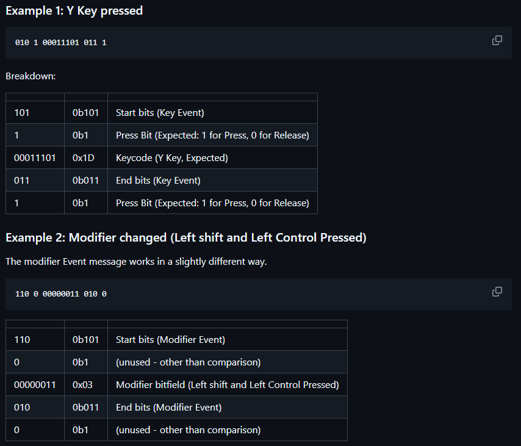

<BlogTitle />

# Refining HID Over UART and Setting Up Documentation

Today was all about refining the keyboard input and getting HID (Human Interface Device) communication over UART to work efficiently. While I was on the move and couldn’t test any code, I spent a lot of time brainstorming and refining ideas through an extended back-and-forth discussion with GPT. I had a clear vision of what I wanted, but I needed to arrive at a structured approach that would address the core issues effectively.

# Identifying the Issues

The primary challenge I faced was handling noise in the data stream. I narrowed it down to three key problems:

1. **Too much data** – Sending excessive information made it difficult to parse efficiently.
2. **Too high speed** – Rapid transmission without proper control mechanisms resulted in unreliable communication.
3. **No start/stop signifiers** – Without clear message boundaries, it was difficult to ensure data alignment.

# Solution: Structured Data Transmission

To address these issues, I decided to introduce start and stop indicators to define message boundaries. While this would slightly increase data size, it would also enhance data alignment and improve reliability.

Having worked extensively with CAN Bus in the past, I took inspiration from its structure. One of the key strengths of CAN is its separation of concerns—messages are structured and do not redundantly transmit unnecessary data. I realised that for HID over UART, I didn’t need to send the entire state continuously; I only needed to transmit changes.

After experimenting with different payload structures, I settled on a **16-bit payload format**:

- **4 bits** for message type
- **8 bits** for the HID keycode
- **4 bits** for termination

With this approach, each keypress or release would generate a single message, and modifier keys would be handled separately. This eliminated the need to flood the UART with empty bytes, resulting in a clean, structured, and efficient communication method.

I’ve documented the technical details in my project documentation: [Design Constraints - HID Over UART](https://quantum-264.github.io/docs/documentation/Design/hid-over-uart.html).

# Documenting the Process

On another note, I decided to start formally documenting my development process. Until now, I had been keeping notes in Notion, which worked fine, but I felt the need for a more structured and publicly accessible devlog.

To get started quickly, I set up a **VitePress** site and began transferring my notes into it. Right now, things are still scattered, but at least they have a permanent home, and I can track changes more effectively over time.

I’m also considering hosting the documentation on **GitHub Pages** soon, and perhaps even creating a **GitHub organisation** since multiple codebases are now taking shape. It feels like the right time to start organising everything properly.

That’s it for today! Time to get back to my dungeon crawl. Until next time!

