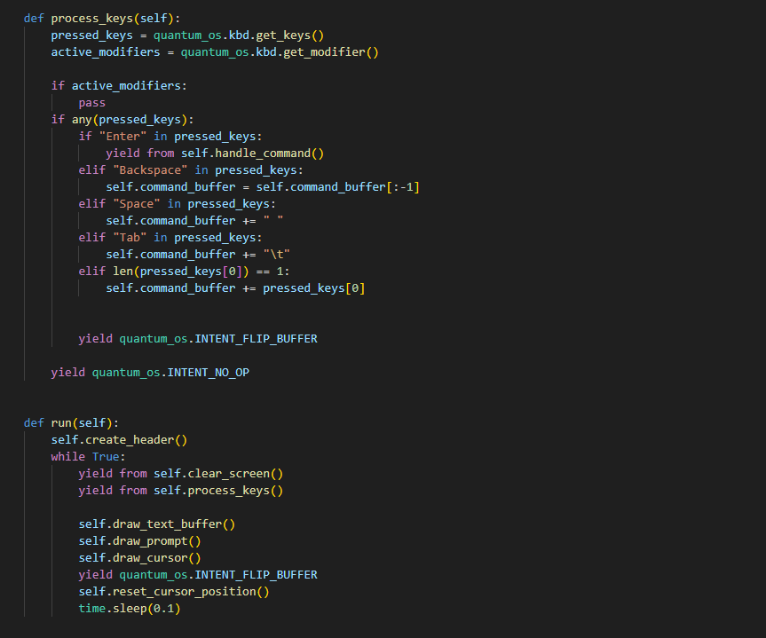

<BlogTitle />

# Progress and Setbacks: Refining HID-over-UART and Terminal Rendering  

Today was a rollercoaster of progress and setbacks. I made significant strides in my HID-over-UART implementation, uncovering new potential and refining my approach, but also encountered some frustrating issues—particularly with flashing and double-writing to buffers. Nonetheless, the journey was a productive one, and I walked away with a deeper understanding of how the system should function.  

## Understanding Buffer Flipping  

One of the biggest revelations of the day came from digging into how Abe was handling intents, specifically the `INTENT_FLIP_BUFFER`. Initially, I followed the smaller examples that used a simple sequence of `set_pen()`, `display.text()`, and `display.update()`. I assumed this was the standard process for rendering to the display. However, after deeper investigation, I realized the update should only be called once the buffer has been fully loaded, following a structured **write → flip → write → flip** pattern.  

This realization forced me to **refactor the entire terminal application**. Instead of rendering elements individually and immediately updating the display, I now ensure that everything needing to be drawn is first loaded into the buffer before flipping it using the intent. This not only improves performance but also makes the rendering process far more structured and predictable.  

## Solving Scrolling and Rendering Issues  

While refactoring, I addressed another major issue: **handling text when it reaches the bottom of the screen**. Previously, there was no clear handling for when the terminal reached its limit, leading to potential display inconsistencies. Now, I maintain a **list of elements to be rendered**, ensuring that the top line gets removed whenever the text hits the bottom. This effectively implements **proper scrolling**, making the terminal behave in a much more natural and expected way.  

The improvement not only makes the terminal look and function better, but it also aligns with how standard terminals handle output overflow. It was a satisfying fix that brought a tangible improvement to usability.  

## The Trade-Off: Input Lag  

Of course, every step forward sometimes comes with unintended trade-offs. The new method of **buffering everything into VRAM before flipping** has introduced a noticeable input lag when typing. The delay is perceptible enough that it affects the user experience, but I didn’t have the time to address it today. It’s on my list of next steps, and I’ll be looking into potential optimizations, whether that’s tweaking how inputs are processed or finding ways to streamline buffer updates.  

## Documentation Overhaul & Project Organization  

Beyond working on the terminal rendering itself, I also tackled a much-needed documentation overhaul and project organization:  

- **Reworked and restructured the documentation**, making it clearer and more user-friendly.  
- **Hosted the documentation under its own organization**, providing a dedicated space for project resources.  
- **Set up the documentation on GitHub Pages**, ensuring easy access for anyone needing reference material.  
- **Documented the HID-over-UART code** and integrated it into the new organization.  
- **Imported my Picovision firmware** into the same organization to consolidate everything in one place.  

This setup provides a **dedicated project page** to track issues, manage contributions, and keep everything neatly organized. Having all related code centralized makes collaboration and maintenance significantly easier moving forward.  

## Looking Ahead  

Despite the input lag issue, today was a **huge step forward**. The refactored terminal app is now cleaner, more structured, and functions far better than before. With improved rendering logic, proper scrolling, and better project organization, the foundation is solid. My next steps include **optimizing performance to reduce input lag** and further refining the user experience.  

