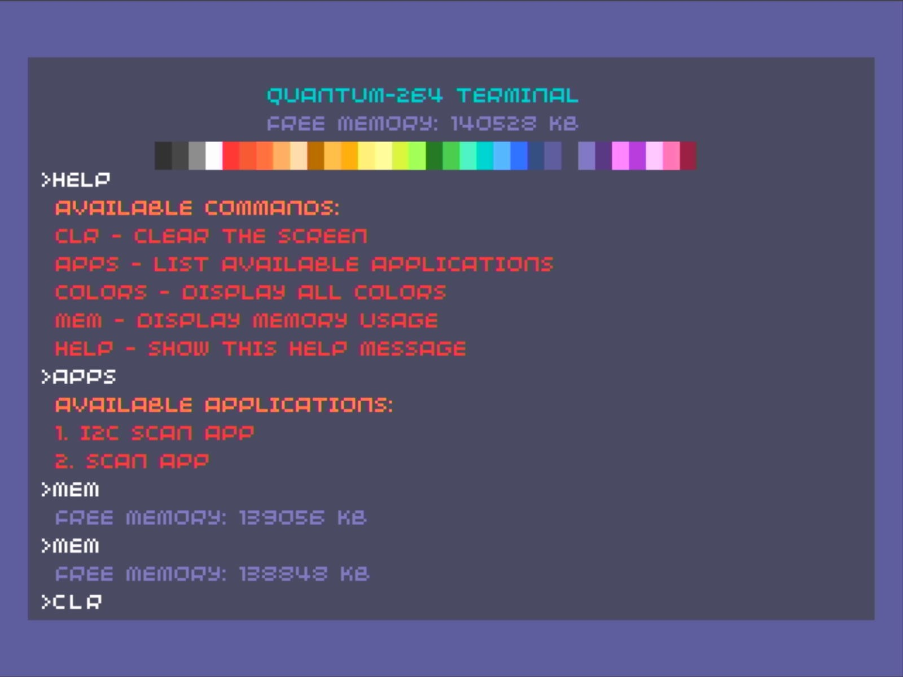
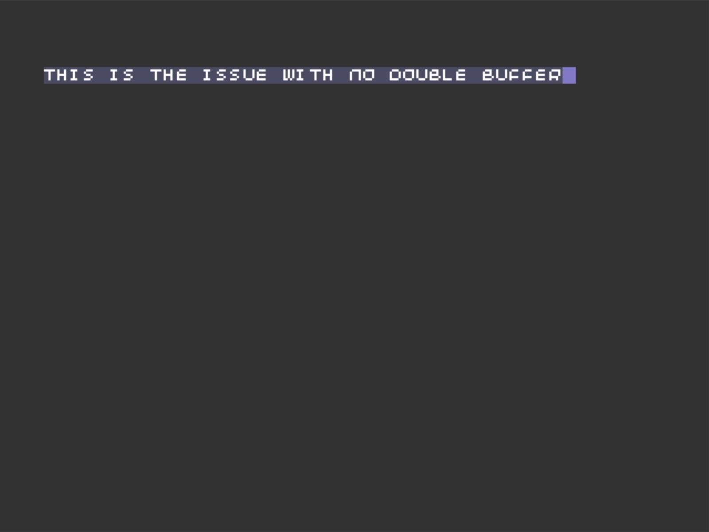
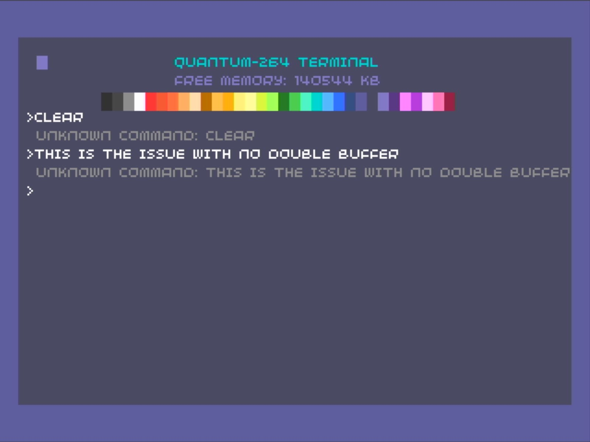

<BlogTitle />




Over the past couple days, I’ve been refining the keyboard experience, tackling lag issues, dealing with poor responsiveness, and adding special character input while I was in that code. While these changes don't provide much visual change, they provide a huge change to how the system feels. The input lag made the system unbearable to use, and now it feels much more responsive. 

The first challenge was dealing with input lag. This was primarilly caused by moving towards the `INTENT_BUFFER_FLIP` system, which resulted in fewer updates, populating the VRAM buffer completely before rendering. This meant that there was a delay between a key being pressed and the screen being updated, which varied depending on how much data was in the buffer. Since waiting for VRAM to fully load before rendering caused delays, I had to adopt a strategy that was somewhere between my first implementation and the `INTENT_BUFFER_FLIP` system... ensuring I was cautious about my `display.update` commands. 

# set_clip

To improve efficiency, I used `set_clip` to render only the portion of the screen where the command is being entered. This way, I could optimize the rendering to affect only the portion of the screen where commands are entered, improving efficiency. This was done by essentially creating a clip that was in the current cursor position, and then rendering only one character at a time. This felt way more responsive. 

## Double render
Using `set_clip` only renders to the portion of the screen that is clipped. This means that the rest of the screen is not updated. To fix this, I implemented a double render system. This system renders the buffer to the screen twice, ensuring that the entire screen is updated. What this means is that the entire UI is loaded into both buffers so that when the clipped portion of the screen is updated, the rest of the screen still looks correct. Otherwise, the screen would look like it was missing data. Like so:
 


With these changes, the keyboard lag was significantly reduced. However, it highlighted other issues with the input system.

# Keyboard debouncing

The next issue was the keyboard was either too responsive or not responsive enough. This was due to the fact that the keyboard was not debounced. This meant that if you held down a key, it would register multiple keypresses. The other issue was that if you typed too fast some keypresses would be missed. The latter was dues to the fact the some keys were pressed before the previous key was released, and there was no buffer for simultaneous keypresses. This was fixed by adding a small buffer (up to 5 keys) for simultaneous keypresses and introducing a debouncer function with a callback. This allowed me to handle different key types, including backspaces and command submissions.

The debouncer function accepts a key, a callback, and a debounce delay. If the key is different from the last key or the debounce delay has passed, the callback is called. The debounce delay is set to 100ms by default. This allows for a flexible handling of different key types, including backspaces and command submissions. The debouncer also yields an `INTENT_NO_OP` so that I can `yield from` the callback. This requires `yield from` to be used when calling the debouncer function.

The debouncer function is as follows:

```python
def debounce(self, key, callback, debounce_delay=100):
        """Debounce a callback function."""
        if key != self.last_key or (time.ticks_ms() - self.last_key_timer) > debounce_delay:
            yield from callback()
            self.last_key_timer = time.ticks_ms()
            self.last_key = key

        yield quantum_os.INTENT_NO_OP
```

# Special character support

Special character support via the Shift key was also added, though I ran into a limitation—the default font doesn’t support lowercase letters. This will be a problem when it comes to writing the code editor as python will require case sensitivity. I’ll need to find a solution for this in the future.

# Conclusion

I feel I’ve struck a good balance. The screen buffer enables smooth scrolling, commands trigger a full refresh buffer flip upon entry, and real-time screen refresh ensures a responsive typing experience while waiting for input.

I left the code in a state where I have a clear path forward. There are likely multiple ways to refine this further, but for now, things are moving in the right direction. Progress is progress!