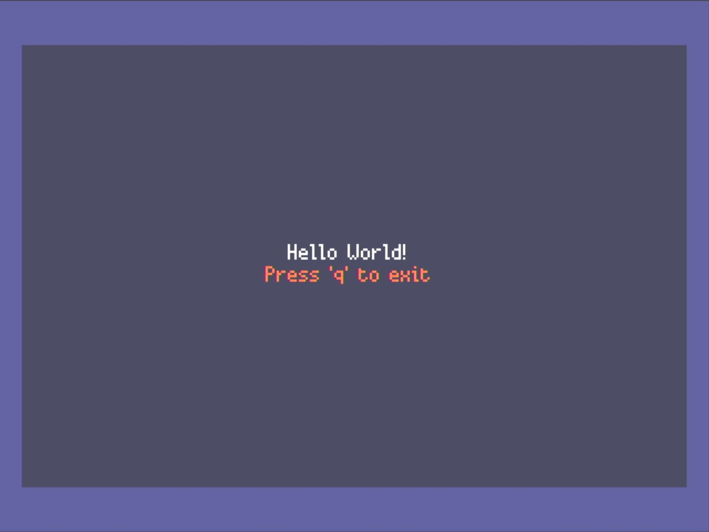
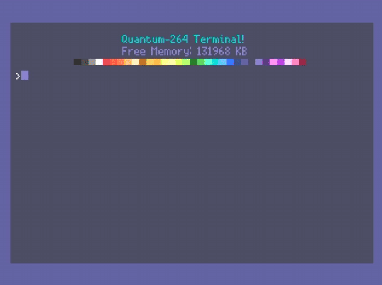

<BlogTitle />

Over the past few days, I've embarked on a journey to enhance the functionality and versatility of the Quantum system. From addressing font limitations to implementing a robust command handler and achieving dynamic application loading, each step has been pivotal in transforming Quantum from a basic interface into a more sophisticated operating system.

## Addressing the Font Challenge

A significant hurdle was the inability to type in lowercase letters, a limitation reminiscent of many 1980s home computers. However, for modern development, especially when writing Python code—such as PicoGraphics MicroPython—case sensitivity is crucial. The default reliance on the `bitmap6` font, which supports only uppercase letters, was a constraint. The solution was to switch to the `bitmap8` font, which includes lowercase characters. This change was straightforward but introduced a minor issue: the colon character appeared too high on the line. While adjusting this would require either modifying the MicroPython source code or adding a custom font file, both approaches have their trade-offs. Modifying the source code seems excessive for a single character, and adding a custom font could impact the limited RAM of the device. Further exploration is needed to determine the most efficient solution.

## Developing a Robust Command Handler

With the font issue addressed, the next focus was on enhancing the command handling system. Previously, the system allowed execution of single commands without arguments, limiting its functionality. To create a more robust system, I abstracted the command handling into its own class. While considering the use of an argument parser, concerns about added bloat led to extending the existing system to support argument parsing. This enhancement enables commands like `load` to accept specific file arguments, significantly increasing the system's flexibility and usability.

## Achieving Dynamic Application Loading

A monumental milestone was the ability to load applications directly from the terminal. This development signifies a transition from a simple application to a more complex operating system. Booting into the terminal and using it to switch between applications showcases the system's dynamic capabilities. While there's still a journey ahead before enabling direct writing and running of games on the device, this achievement provides confidence in the system's potential and future possibilities.

This also led to one of my proudest "Hello World" moments. Instead of simply printing text to the screen, Quantum OS is now capable of booting into the terminal and executing commands to load different applications. This makes the difference between an app and an OS much clearer—Quantum is no longer just a collection of scripts but a functioning system capable of managing its own processes.

To further test this, I successfully booted into Abe's I2C scanner app directly from the terminal, demonstrating the flexibility of the new system. This is a massive step forward, showing that Quantum OS can load and execute different applications dynamically, rather than being locked into a single-use program.

In conclusion, these advancements mark significant progress in Quantum's evolution. Addressing the font limitations, enhancing the command handler, and enabling dynamic application loading have collectively transformed the system, paving the way for more complex functionalities and a richer user experience. With this newfound capability, the path to running full-fledged applications and even games on the device feels more achievable than ever.

---

# Every project needs a logo

I also made a logo. This is inspired from a wave function diagram, with the `r=cos(2θ)` which is often used in the Quantum Computing field. I thought it was a nice touch to have a logo that was inspired by quantum computing, yet still had a retro feel to it. The logo also forms a Q and a 264 and is coloured using the Quantum 264 colour palette. I like it.
 

