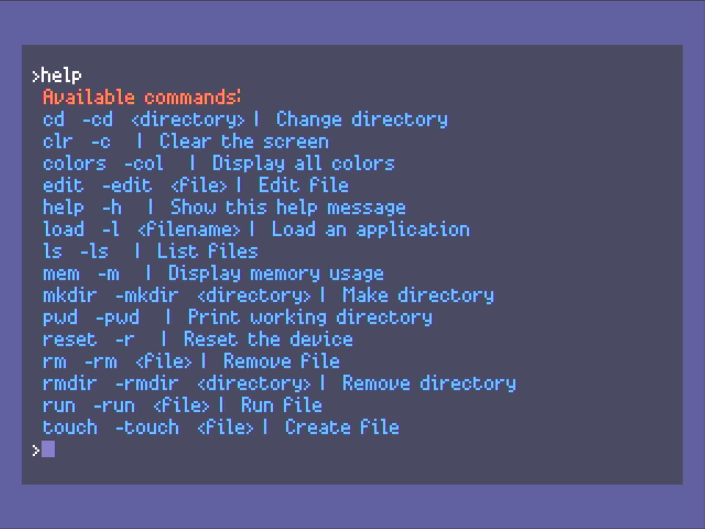

<BlogTitle />

Today’s session was more about refinement and infrastructure. Less flashy, but just as critical. The goal was to tidy up, streamline, and lay the groundwork for more reliable on-device development, especially as Quantum OS continues to evolve.

The first housekeeping task was a structural one: the Terminal app has officially moved out of the apps directory. It never really belonged there. As a core system tool rather than a user-facing "app," it now resides where it should—in the quantum_os directory. This small change is part of a broader effort to better delineate between user-modifiable content and the underlying system framework.

While in Terminal land, I expanded its OS-level control capabilities by adding fundamental commands like `rm`, `rmdir`, `mkdir`, `touch`, `ls`, `cd`, and `pwd`. These are essential for file navigation and manipulation, bringing the experience closer to a real operating system. To reinforce the separation between system and user space, I also set the root directory to the apps folder. This should help prevent users from accidentally modifying or deleting critical system files while exploring and editing.

The file-loading logic also received an overhaul. Previously, you’d list files with the `apps` command, which found all files where the filename ended in `_app` and then load them with an index e.g., `load 0`. Now, it’s a much cleaner and more intuitive experience. You use `ls` to list available files and simply load filename to bring one into memory. This aligns more with conventional command-line experiences and just feels right.

On the syncing front, I’ve cleaned out all the core PicoVision files from the repository. Now, only the development code gets loaded onto the device. This trims down sync times and ensures that only active development content is being pushed to hardware.

One of the more foundational changes today was the addition of a global environment variable dictionary. This new structure allows the OS to store and access state-level data more cleanly. It's especially helpful for the revised behavior of the `load` command. Instead of immediately executing a program, `load` now designates a file as the `selected_app` - much like how Pico-8 and the Commodore 64 worked. Once a file is loaded, users can run it with `run`, open it in the editor with `edit`, and eventually trigger commands like `ctrl+r` or `esc` for shortcuts (like the pico).

To help differentiate between tools that might look visually similar—like the **Terminal** and **Text Editor**, I added a border color changer. Apps can now define their own border color, which adds a layer of visual clarity when switching between contexts. Later I will look to have a different look and feel for different apps, but this helps for now. 

It was a shorter session today, but I still found time to flag a few items into the GitHub backlog. Mainly concerns around error handling and stability. There's a long road ahead when it comes to gracefully managing invalid commands, bad filenames, and improper arguments. At some point, proper testing will be essential, though I’m still figuring out how feasible that is at this stage.

One major concern that hit me today: **error visibility**. Right now, all Python execution errors and system-level crashes get routed to the USB console, which is visible only through Thonny or VS Code (with PyMkr). This works fine during tethered development, but since the goal is on-device editing and standalone coding, that model falls apart. If you can’t see what went wrong directly on the device, you can’t really debug. And if you need a computer to debug, it defeats the entire point of building a self-contained coding environment. This is slightly more than concerning!

So while today’s changes weren’t huge in scale, they’re laying down crucial pieces of the puzzle. The direction is clearer, the architecture is tighter, and the vision of on-device development and full autonomy, is still very much alive - so long as the backlogged item doesn't come back to bite me!