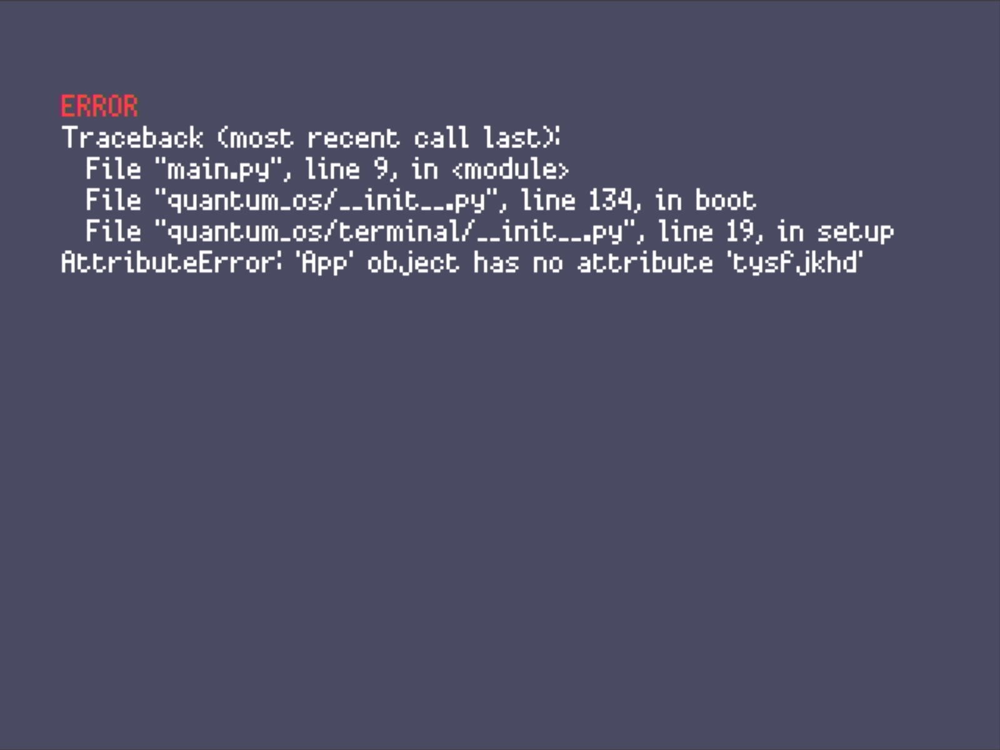

<BlogTitle />



The past few days have been deep in the weeds of a deceptively simple but mission-critical feature: error visibility. For any embedded or standalone system to truly stand on its own, it must be capable of not only failing gracefully but making those failures visible to the developer or user. In traditional development environments like Thonny or PyMakr, Python exceptions are streamed to the USB console. But in a self-contained OS? That luxury disappears.

So began the quest to bring those hidden messages into the light.

At first, I thought I could just pepper `try/except` blocks around the codebase to catch exceptions. But that quickly revealed its limitations. If the issue was something as simple (and common) as a typo, Python wouldn't even load the file, let alone hit the `try` block. Next came attempts to hijack the standard I/O and reroute it—somewhat successful in theory, but problematic in practice. Then I explored the idea of overriding `__builtins__`, only to find out that MicroPython doesn’t expose it the way CPython does. Another dead end.

Eventually, the breakthrough came with a much simpler, more robust solution: wrap the entire boot sequence in a single `try/except`, then capture and display the full traceback directly on the screen. Here's the `main.py` now:

```python
import quantum_os
import quantum_os.terminal as terminal_app
from quantum_os.display import *
from quantum_os.utils import *
import sys
import io

try:
    quantum_os.boot(terminal_app.App)

except Exception as e:
    buf = io.StringIO()
    sys.print_exception(e, buf)
    traceback_text = buf.getvalue()

    for _ in range(2):
        display.clear()
        display.set_pen(COLORS[22])
        display.rectangle(0, 0, WIDTH, HEIGHT)
        display.update()

    write_text_double_buffer("Runtime Error", COLORS[6], y=DEFAULT_CURSOR_Y, scale=2)
    line_height = int(LINE_HEIGHT / 1.8)
    y = DEFAULT_CURSOR_Y + LINE_HEIGHT

    for line in traceback_text.splitlines():
        write_text_double_buffer(line, TEXT_COLOR, y=y, scale=1)
        y += line_height
        if y + line_height >= HEIGHT:
            break

    display.update()
```

What this does is elegantly simple: catch any boot-time exceptions, stringify the traceback, and render it directly onto the device display. The result? A proper BSOD (yes, I went all in and made it blue), bringing a desktop-class debugging experience to this tiny OS.

It's a small change in terms of lines of code, but it’s monumental in terms of impact. With this mechanism in place, I can now detect and debug errors without tethering to a development console—moving one step closer to a truly standalone system.

There’s something incredibly satisfying about seeing a crisp traceback appear onscreen, even if it’s announcing failure. Because now, failure speaks.

