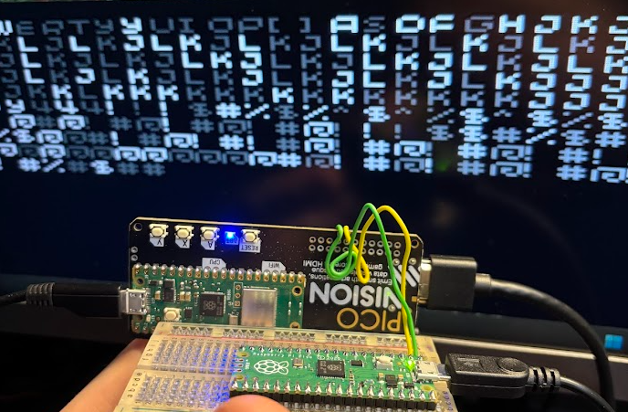

<BlogTitle />

### The Journey to Building My Own Retro Home Computer

For around 2 years now, I have had a vision of creating a retro home computer. I often research ideas, do a lot of reading and watch a lot of videos on the subject. I have a lot of ideas and I am always thinking about how I can make them a reality. I have experimented with a few different boards and I have a few ideas for projects that I would like to work on. My overall vision is to create a computer that is basically just a keyboard that boots straight into an interpretter. In essence a modern day C64 or ZX Spectrum. However, Along the way I explored fantasy consoles such as the TIC-80 and PICO-8. I have also been looking at the Raspberry Pi Pico and the RP2040 chip.

This idea is always on my mind, I often research, experiment, and explore various technologies related to this topic. I’ve spent countless hours reading articles, watching videos, and testing different boards, without any real idea if I ever would commit to making something, but just due to the sheer enjoyment of the field. Throughout this journey, I’ve encountered fascinating concepts, from fantasy consoles like the TIC-80 and PICO-8 to hardware platforms like the Raspberry Pi Pico and the RP2040 chip along with a whole host of AVR boards that I've tinkered with, but never really felt the spark of creativity I needed. Each of these discoveries has influenced my thinking, expanding my ideas beyond just a home computer to other potential projects like handheld computers, physical fantasy consoles with cartridges, and even a standalone serial terminal.

### Commander X16

One of the most exciting discoveries I made was the Commander X16. The idea of a modern-day retro computer with a 6502 processor and a focus on simplicity and ease of use was incredibly appealing. I followed the project closely, watching videos and reading articles about its development. The Commander X16 started with a vision using actual ICs and no FPGA, but as the project evolved, it shifted to using an FPGA for the video output. The second vision was the financial aspect - the aim for a modern-retro home computer that was low cost. It wasn't long before that vision changed - and the machine became more powerful and more expensive. At aroun $500 for something more than just a circuit board, and the inclusion of FPGA, I felt that the project had lost its original vision. It also seems to have limited stock outside of the US, which is a shame.

### A Chance Encounter with SlimeOS and PicoVision

One of the more intriguing, and most recent finds on my journey came while researching ideas for a powerful handheld computer. I wanted something with desktop-level performance in a GameBoy-like form factor (well at least a Pi5). Basically I wanted a portable powerhouse which would have a whole host of tools and capable of running kali linux to make a portable hacking device. During this search, I stumbled upon SlimeOS. Initially, I dismissed it outright. “Not what I want,” I thought. The Raspberry Pi Pico, in my mind, wasn’t suited for my handheld vision. I was after something significantly more powerful.

Little did I know that my path would soon lead me back to SlimeOS. One day, YouTube’s recommendation algorithm surfaced a video about PicoVision, a programmable audio-visual board introduced by Pimoroni. I almost ignored it, but curiosity got the better of me. Watching that video, something clicked. I suddenly saw potential where I hadn’t before. I knew I had seen the board, but I didn't put 2 and 2 together. Then it clicked - I revisited the SlimeOS video and realized that while Abe’s vision for the handheld project was quite different from mine, there was definitely a lot of common ground with my home computer project. In retrospect, it’s funny: I had been subscribed to Abe’s channel for some time due to my interest in their other work. However, after rewatching their video with this new perspective, I saw the potential of PicoVision in a whole new light.

### Getting My Hands on a PicoVision

Over the weekend, I took the plunge and bought my first PicoVision. It took a couple of days to arrive, but I could immediate see a whole host of ideas, but was a little dissapointed by the lack of keyboard support. I bought the extended version with the cables for plugging keyboards in but I hadn't realised I needed to use the PicoVision in C++ mode to get the keyboard to work. Moreover, the TinyUSB library also takes up a lot of processing power, so it wasn't ideal for my vision. I was a little disheartened, but I wasn't about to give up. I had a spare Pico lying around, so I set it up in TinyUSB Host mode and transmitted keypresses over UART. After battling with random giberrish and GPU buffering issues, I was staring at a console displaying the words:

**"TYPE HELP FOR COMMANDS"**

Of course there were no commmands, but I was drawing text to the screen and was able to write characters from the keyboard into the 'console'. And just like that, my project had legs. While it is not the first time I have a 'console' on a pico, and it was even far from the most difficult, the ability to utilise a premade graphics library, fonts, color palettes and access a file system with ease was a game changer. I was able to focus on the interpreter and the input method, rather than the graphics and the display.

### Looking Ahead

This is only the beginning. Now that I have a working input method and a foundation to build upon, my mind is racing with possibilities. I started coding. There was no plan and I purposely didn't look SlimeOS or anything other than the examples on the Pimoroni supplied SD card. I felt like I was making bad choices, but I also felt like it was moving forward, which at the time was all that mattered. 

