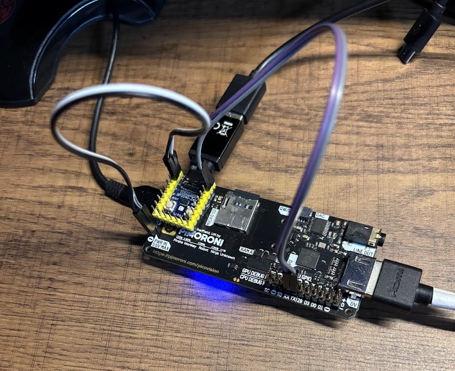

<PageTitle />

# HID Over UART

To get the keyboard working beyond a simple ASCII over UART, I needed to implement HID over UART. This was a bit of a challenge, as the UART is not as fast as USB, and the RP2040 is not as powerful as a full computer. I tried sending over the raw HID data, but it was too much for the RP2040/UART to handle.

Therefore I decided to send a custom payload over UART. This payload is a simple 16-bit message that represents a key press or release event. This is detailed below.

# Wiring

Below shows how to wire up both using the RP2040 as the Keyboard host as well as using 2 picos. I recommend the [Waveshare RP2040 Zero](https://www.waveshare.com/rp2040-zero.htm) as it has USB, so if you have a USB C Keyboard (or a USB-A -> USB-C adapter lying around). This makes the setup so much simpler.  


> Note: I am using the PicoVision as my CPU, I can leave the power and UART connected when programming the RP2040. I have not tested this direct into a Pico, I don't think it will conflict as unlike an Arduino the USB Boot mode doesn't work over UART. If it does conflict, just unplug V-BUS or put a switch on V-BUS for programming mode. 



# Message Format

The fundamental change in this project came from my desire to switch away from ASCII over UART. I decided instead to send a custom payload over UART.

The payload is a simple 16-bit message that represents a key press or release event. The message is broken down as follows:

### Example 1: Y Key pressed

```
010 1 00011101 011 1
```

Breakdown:

||||
|-|:-|:-|
| 101          |   0b101   |	Start bits (Key Event)                                | 
| 1            |   0b1     |	Press Bit (Expected: 1 for Press, 0 for Release)      |
| 00011101     |   0x1D    |	Keycode (Y Key, Expected)                             | 
| 011          |   0b011   |	End bits (Key Event)                                  |
| 1            |   0b1     |	Press Bit (Expected: 1 for Press, 0 for Release)      |

### Example 2: Modifier changed (Left shift and Left Control Pressed)

The modifier Event message works in a slightly different way.

```
110 0 00000011 010 0
```

||||
|-|:-|:-|
| 110          |   0b101   |	Start bits (Modifier Event)                             | 
| 0            |   0b1     |	(unused - other than comparison)                        |
| 00000011     |   0x03    |	Modifier bitfield (Left shift and Left Control Pressed) | 
| 010          |   0b011   |	End bits (Modifier Event)                               |
| 0            |   0b1     |	(unused - other than comparison)                        |


# Keyboard.py

With this in place the Keyboard.py script on the PicoVision can be used to read the HID from the UART 

```python
import quantum_os
from quantum_os.hid_keycodes import get_key_name, get_modifier_name

class Keyboard:
    def __init__(self):
        self.uart = quantum_os.get_expansion_uart()
        self.keys = bytearray(7)  # Stores last 7-byte HID report
        self.prev_keys = bytearray(7)
        self.pressed_keys = set()
        self.modifier = 0x00

    def update(self):
        """Reads and stores the latest HID report if available."""

        data = self.uart.read(2)

        if not data or len(data) != 2:
            return None  # Invalid packet size
        
        #print as 16-bit binary
        packet = (data[0] << 8) | data[1]  # Combine two bytes into one 16-bit value

        start_bits = (packet >> 13) & 0b111
        action = (packet >> 12) & 0b1
        keycode = (packet >> 4) & 0xFF
        stop_bits = (packet >> 1) & 0b111
        stop_action = packet & 0b1  # Redundant press/release verification

        # Validate packet
        if action != stop_action:
            return None  # Corrupted data

        if start_bits == 0b101 and stop_bits == 0b011:
            # Process key events
            if action:
                self.pressed_keys.add(keycode)
            else:
                self.pressed_keys.discard(keycode)

            action = "Pressed" if action else "Released"

        elif start_bits == 0b110 and stop_bits == 0b010:
            # Process modifier events
            self.modifier = keycode  # Store new modifier state

    def get_keys(self):
        """Returns human-readable key names from currently pressed keycodes."""
        return [get_key_name(k) for k in self.pressed_keys]

    def get_modifier(self):
        """Returns a list of active modifier keys."""
        return get_modifier_name(self.modifier)

```